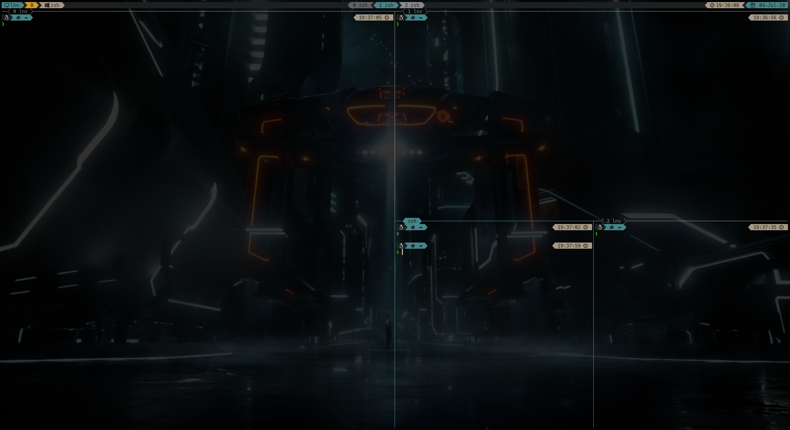
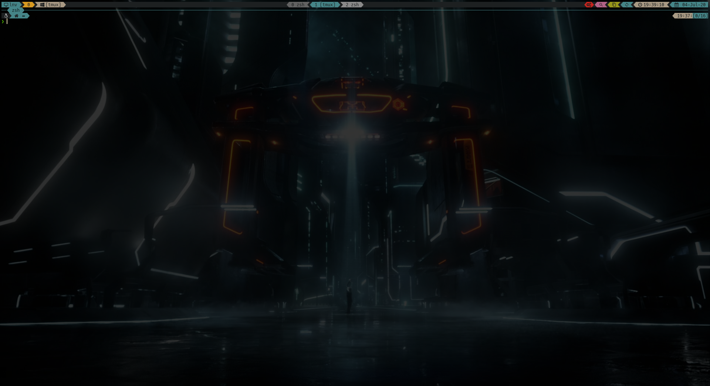
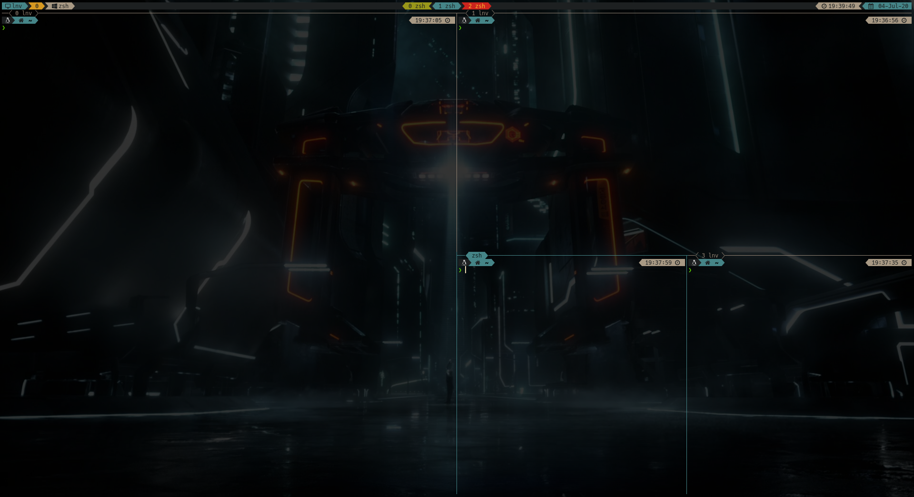

# pl33t
Powerline-extra enabled theme for Tmux.
## Screenshots
||||
|-|-|-|

## Installation
### with [Tmux Plugin Manager](https://github.com/tmux-plugins/tpm)

Add plugin to the list of TPM plugins in `.tmux.conf`:

    set -g @plugin 'illtown/pl33t'

Hit `prefix + I` to fetch the plugin and source it.

### manual

Clone the repo:

    $ git clone https://github.com/illtown/pl33t ~/clone/path

Add this line to the bottom of `.tmux.conf`:

    run ~/clone/path/pl33t.tmux

Reload TMUX environment:

    # type this in terminal
    $ tmux source-file ~/.tmux.conf

## Dependencies

To run this theme you need:

* bash
* tmux >= 3.1
* powerline enabled fonts ([nerdfonts](https://www.nerdfonts.com) recommended)

## Customization
Default theme settings are located in [variables.sh](scripts/variables.sh) file and have `@pl33t-` prefix. You may override them in your `tmux.conf`.
### status lines
In the beginning pl33t checks `@pl33t-status-lines` variable, which tells how many status lines it's going to pre-configure (tmux allows you to have upto 5 status lines, numbered 0-4).
Then, each line gets divided into 3 parts: left, centre and right. Pl33t fills tmux `status-format[x]` variables to achieve that:
```
status-format[0] "#{T:@pl33t-status-0-left-format}#{T:@pl33t-status-0-centre-format}#{T:@pl33t-status-0-right-format}"
status-format[1] "#{T:@pl33t-status-1-left-format}#{T:@pl33t-status-1-centre-format}#{T:@pl33t-status-1-right-format}"
```
Pl33t then introduces new level of abstraction - segments, which are the building blocks for these left, centre and right format options.
The process of configuring status lines (and pane borders) looks like this:
  * define segments and its parameters (explained below)
  * fill `@pl33t-status-(0|1|2|3|4)-(left|centre|right)-segments` variables with comma-separated lists of segment names. Number specifies status line in question.
  * fill `@pl33t-pane-(active|other)-border-segments` variables with lists of segment names.
### segments
Each segment consists of 3 variables:
  * `@pl33t-segment-<name>-content`. Defines the segment content
  * `@pl33t-segment-<name>-separator`. Segment separator settings:
    * direction. Defines left and right segment's separator directions. Direction string is searched for words 'left' and 'right' and whether they are seen at the beginning or end of the string. For example, `left` is a shorthand for `left-left`.
    * shape. One word parameter, e.g. triangle. complete list of shapes may be found at the bottom of [variables.sh](scripts/variables.sh) (pl33t_pl_* variables).
    * `clear`. specifies clear segment separators to be used instead of opaque (default).
  * `@pl33t-segment-<name>-style`. Corresponds to tmux style settings. This style string may include pl33t-specific attributes:
    * `tmp`. makes segment invisible if it's content is 0 or empty
    * `length=<len format>`. wrapper for tmux's length style specifier.

You may choose any segment name you want as long as it gets referenced under `@pl33t-*-segments` variables.

There is one reserved segment name - `winstatus`, which deals with window list and has its own set of `@pl33t-winstatus-*` variables.
### examples
Try adding this to your `tmux.conf`:
```
# ---- tmux-pl33t ----
# status line segments
# copy-mode indicator
set -g @pl33t-segment-mode-content "#{?#{pane_in_mode},  ,}"
set -g @pl33t-segment-mode-separator 'left,triangle'
set -g @pl33t-segment-mode-style "fg=black,bg=green,tmp"
# synchronize-panes indicator
set -g @pl33t-segment-sync-content "#{?#{pane_synchronized}, 痢,}"
set -g @pl33t-segment-sync-separator 'left,triangle'
set -g @pl33t-segment-sync-style "fg=black,bg=blue,tmp"
# zoom indicator
set -g @pl33t-segment-zoom-content "#{?#{window_zoomed_flag},  ,}"
set -g @pl33t-segment-zoom-separator 'left,triangle'
set -g @pl33t-segment-zoom-style "fg=black,bg=magenta,tmp"
# prefix indicator
set -g @pl33t-segment-prefix-content "#{?#{client_prefix}, ,}"
set -g @pl33t-segment-prefix-separator 'left-right,triangle'
set -g @pl33t-segment-prefix-style "fg=black,bg=red,tmp"
# status line segments
set -g @pl33t-status-0-right-segments 'prefix,zoom,mode,time,date'
```
This example shows how to define your own segments and the use of `tmp` style parameter (pl33t-specific).
